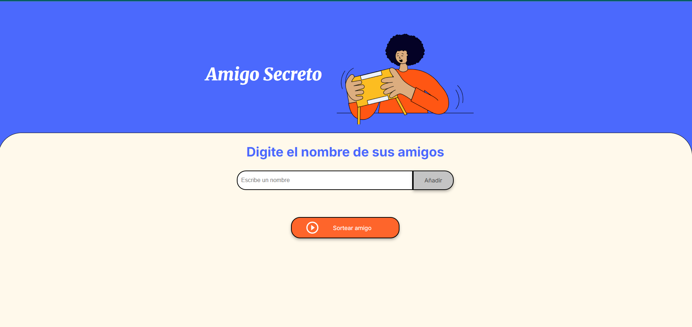

# Juego del Amigo Secreto

Un pequeño juego hecho con **HTML, CSS y JavaScript** que permite a los usuarios agregar nombres a una lista y realizar un sorteo aleatorio para elegir un *amigo secreto*.

## Pantalla principal

## ✨ Características
- Agregar nombres mediante un campo de texto y un botón.
- Validación para evitar entradas vacías o numéricas.
- Visualización de los nombres agregados en pantalla.
- Sorteo aleatorio que muestra el resultado en la página.

## 🛠️ Tecnologías
- HTML5
- CSS3
- JavaScript (Vanilla)

## 📌 Cómo usar
1. Clona este repositorio o descarga el ZIP.
2. Abre el archivo `index.html` en tu navegador.
3. Escribe nombres en el campo de texto y presiona "Añadir".
4. Cuando tengas varios nombres, haz clic en "Sortear Amigo".
5. El nombre sorteado aparecerá en pantalla.

